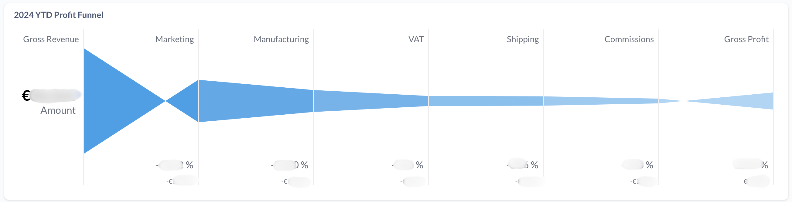

# One Click Data Pipeline for E-commerce Profitability (dbt, Shopify, Facebook, Fedex, GLS and other costs)

## Intro

## End result of the project

Here are the few dashboards that were built on top of the data model built from this repo. 

**1. Overview of Revenue and Profits**

This view gives the business the ability to understand Revenue and Profits, with possibility to drill down at the level of an order.

**2. Overview of Impact of different Cost Factors in EUR and % of Revenue**

This view gives the business the ability to understand how does each cost factor impacts overall profitability, with possibility to drill down at the level of an order.

**3. Map of Countries with highest Profit Margins after deducting all the costs from Order Revenues**

This view gives the business the ability to understand which countries see highest margins, with possibility to drill down at the level of an order.

**4. Overview of Performance of Paid Marketing and ROI (Profits made from 1 EUR of Marketing Investment)**

This view gives the business the ability to optmise marketing spent not on ROAS which takes into consideration sales but on ROI (Return being Profits). In Revenue a lot of country specific costs like VAT, shipping can lead to widely different Profit outcome. 

## Overview of Repo

This project goal is to create a fully modular data pipeline aimed at calculating e-commerce profitability. This pipeline is designed to be open-source and easily reusable, enabling data teams to quickly deploy a robust profitability model without starting from scratch.

This repository is a production dbt pipeline example that models the profitability of an e-commerce business. Data is extracted and loaded to a BigQuery data warehouse by Airbyte. 
The main goal of this repo is to show a production pipeline for a common analytics use case (improving profitability).

## Data Sources

- **Shopify**: E-commerce platform data (including  Shopify Orders, Shopify Balance Transactions, Shopify Transactions)
- **Facebook Ads**: Paid Marketing  (Facebook Advertising) data
- **Paypal**: Payment processing data (coming from Shopify)
- **FedEx and GLS**: Shipping data (coming from GSheets)
- **Manufacturing Costs**: Cost data from the manufacturing process (coming  from Gsheets)

## Models

Detail the dbt models included in the project and their relationships.
- `staging` models: Models raw data from source systems
- `intermediate` models: Models Revenue, and all costs separately. Join and aggregate data from staging models.
- `final` models: Calculates profitability metrics and other business KPIs and build fact_orders table including all costs at order level

### More details about each specific part of the pipeline

Documentation of model to **combine all costs at the level of an order** once each cost has been modeled: 
 https://blog.getdot.ai/automating-end-to-end-profitability-reporting-for-your-e-commerce-business-shopify-fedex-paypal-c65c31a69441

Documentation of model to get **VAT costs** at the level of an order:
 https://blog.getdot.ai/how-to-model-vat-costs-to-the-level-of-order-for-profitability-calculation-in-e-commerce-e315c1d47f95

Documentation of model to get **Manufacturing Costs** at the level of an order:
 https://blog.getdot.ai/how-to-model-manufacturing-costs-to-the-level-of-order-for-profitability-calculation-in-e-commerce-c553ad327339

Documentation of model to get **Shipping costs** at the level of an order:
 https://blog.getdot.ai/how-to-model-shipping-costs-to-the-level-of-order-for-profitability-calculation-in-e-commerce-b5cd3b400ace

Documentation of model to get **Commission Fees** at the level of an order:
 https://blog.getdot.ai/how-to-model-commission-fees-shopify-paypal-to-orders-for-profitability-calculation-in-937d4a8b0fe9

Documentation of model to get **Marketing Costs** at the level of an order:
 https://blog.getdot.ai/how-to-model-marketing-costs-to-the-level-of-order-for-profitability-calculation-in-e-commerce-06fa6bade89f

## Data lineage 

## Feedback
We would love to hear your feedback or about your struggles with integrating data! 
Please reach out to us at hi@getdot.ai or DM us in the dbt or Airbyte Slack channels.

## Disclaimer

This repository can be installed to create a "one click pipeline." However, you will need to recreate the sources for cost data because they are custom to the business. The Facebook, Shopify, and Paypal transformations should be plug and play.

## Buuilt with ❤️ by team at Dot (https://www.getdot.ai/)
